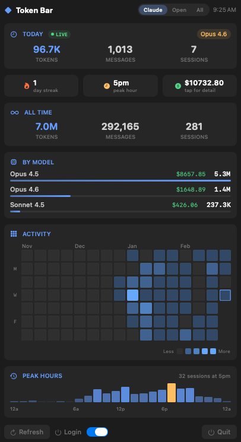
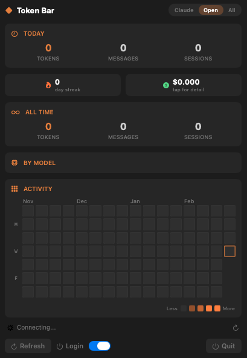

# Token Bar

A native macOS menu bar app for monitoring AI coding assistant token usage at a glance.

<p align="center">
  
  &nbsp;&nbsp;
  
</p>

## Features

- **Multi-Provider Support** — Toggle between Claude Code, OpenCode, or combined view
- **Local + Remote** — Reads OpenCode data from this machine and remote machines via SSH, merged automatically
- **Live Token Counting** — Scans active session files for real-time today stats, not just cached data
- **Activity Heatmap** — 16-week GitHub-style calendar with hover tooltips showing per-day metrics
- **Cost Estimation** — Calculates approximate USD spend per model using API pricing (click for full breakdown)
- **Model Breakdown** — All-time token usage by model with relative progress bars and cost per model
- **Streak Counter** — Consecutive days with coding activity
- **Peak Hours** — 24-hour session distribution chart highlighting your most productive time
- **Launch at Login** — Toggle to start automatically on boot
- **Dark Theme** — Designed to look clean alongside your menu bar

## Requirements

- macOS 14+
- Swift 5.9+
- Claude Code installed (`~/.claude/` directory)
- For OpenCode: Python 3 (local and/or on remote machine)

## Quick Start

```bash
git clone https://github.com/dougchansan/token-bar.git
cd token-bar/TokenBar
./build.sh
open build/TokenBar.app
```

The app runs in the menu bar only (no dock icon). Click the `◆ Model | Tokens` label to open the panel.

## Setup

### Claude Code (works out of the box)

If you have Claude Code installed, Token Bar reads from `~/.claude/stats-cache.json` and scans session JSONL files under `~/.claude/projects/` automatically. No configuration needed.

- Models: Opus, Sonnet, Haiku (all versions)
- Data: polled every 30 seconds, live session scanning for real-time counts

### OpenCode (local)

If you use [OpenCode](https://opencode.ai) on this Mac, Token Bar reads it automatically too.

**1. Install OpenCode** (if not already installed)

```bash
npm install -g opencode-ai
```

**2. Use it with any provider** (Ollama, Moonshot/Kimi, etc.)

```bash
# Example: run with a local Ollama model
ollama pull glm4
opencode --model ollama/glm4

# Example: run with a built-in free model
opencode --model opencode/kimi-k2.5-free
```

**3. Token Bar picks it up automatically**

The app reads from `~/.local/share/opencode/` — supports both SQLite (v1.2+) and legacy JSON storage (v1.1.x). Click **Open** in the header to see your OpenCode stats.

### OpenCode (remote machine via SSH)

To also pull OpenCode stats from a remote machine (e.g., a Windows PC, Linux server, or GPU rig):

**1. Configure the remote host**

Edit `TokenBar/TokenBar/OpenCodeReader.swift` and update the defaults in `init()`:

```swift
init(host: String = "YOUR_IP_OR_HOSTNAME",
     user: String = "YOUR_USERNAME",
     scriptPath: String = "opencode-stats.py")
```

**2. Set up SSH key auth** (passwordless login required)

```bash
# Generate a key if you don't have one
ssh-keygen -t ed25519

# Copy it to the remote machine
ssh-copy-id user@your-host

# Verify it works
ssh user@your-host "echo connected"
```

**3. Deploy the aggregation script**

```bash
scp scripts/opencode-stats.py user@your-host:opencode-stats.py
```

**4. Test it**

```bash
ssh user@your-host "python opencode-stats.py"
```

You should see JSON output with token usage. If you see `{"error": "no opencode data"}`, OpenCode hasn't been used on that machine yet.

**5. Rebuild and launch**

```bash
cd TokenBar
./build.sh
open build/TokenBar.app
```

Local and remote data are merged automatically. The status bar shows "Local + 10.0.0.50" when both sources are connected.

> **Note:** The aggregation script (`scripts/opencode-stats.py`) supports both SQLite (OpenCode v1.2+) and legacy JSON (v1.1.x) storage. It detects the format automatically. The remote machine needs Python 3.

### Disabling remote / local

- **No remote machine?** Leave the default host — if SSH fails, the app gracefully falls back to local-only data.
- **No local OpenCode?** That's fine too — remote-only works. Install OpenCode only if you want to track local usage.

### Provider Toggle

Click **Claude** / **Open** / **All** in the header to switch views:
- **Claude** — Local Claude Code stats only
- **Open** — OpenCode stats (local + remote merged)
- **All** — Everything combined from all sources

## Menu Bar Display

Shows your most-used model today and total token count:

```
◆ Opus 4.6 | 783.9K
```

When set to OpenCode or All:

```
◆ Kimi K2 Turbo | 98.5M
◆ All | 99.3M
```

## Cost Calculation

Estimated costs are computed from token counts using published API pricing:

**Anthropic (Claude Code)**

| | Input | Output | Cache Read | Cache Write |
|---|---|---|---|---|
| **Opus** | $15/M | $75/M | $1.50/M | $3.75/M |
| **Sonnet** | $3/M | $15/M | $0.30/M | $0.75/M |
| **Haiku** | $0.80/M | $4/M | $0.08/M | $0.20/M |

**Moonshot AI (OpenCode)**

| | Input | Output | Cache Read |
|---|---|---|---|
| **Kimi K2 Turbo** | $1.15/M | $8.00/M | $0.15/M |
| **Kimi K2.5** | $0.60/M | $3.00/M | $0.10/M |

Local Ollama models (GLM-4, Qwen, Llama, Mistral, etc.) show $0 — they're free.

Click the cost pill in the app for a per-model line-by-line breakdown.

## Architecture

- **SwiftUI** with `MenuBarExtra` (`.window` style)
- **No external dependencies** — pure Swift + AppKit/SwiftUI
- Polls `stats-cache.json` every 30 seconds (skips re-parse if file unchanged)
- Scans session JSONL files for live today metrics
- Python script for OpenCode data aggregation (local + SSH)
- Merges local and remote OpenCode data automatically
- Background-only app (`LSUIElement = true`)

## License

MIT
